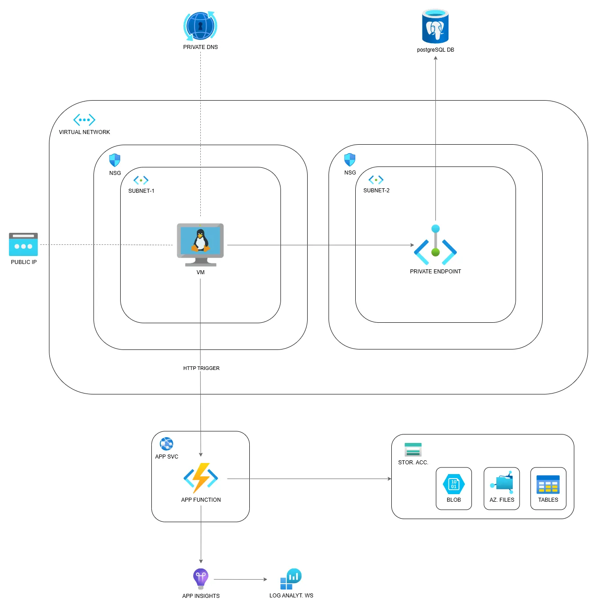
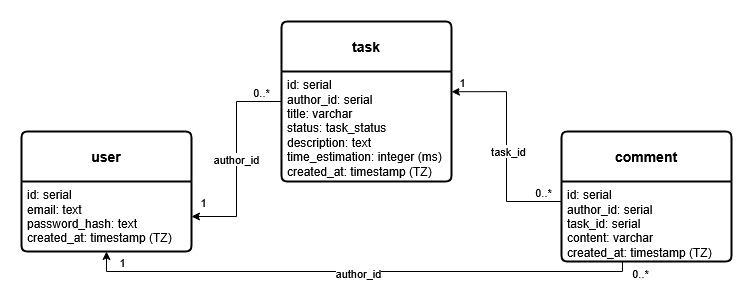

# Tasks Management App

A portfolio project about architecting and deploying a full-stack application on Azure cloud.
Available on: https://appvm-h7iclrjvocq2q.francecentral.cloudapp.azure.com

## Azure Deployment
The whole app is deployed on Azure using IaaS and PaaS. It was designed with a few key principles in mind:
 1. Minimize cost by leveraging free-tier resources and avoiding auto-scaling
 2. Avoid over-engineering
 3. Always keep in mind Security best-practices within a financial constraint



Main components:
### Compute
 - Linux Virtual machine
 - (App Services), Function App
### Network
 - Virtual Network
 - Subnets for network segmentation
 - Network Security Groups for handling inbound and outbound requests (+ nginx for rate limiting)
 - Public IP
 - Private Endpoint and Private DNS for keeping the connection between the VM and the DB private (DB not exposed to the public internet)
### Data
 - Azure PostgreSQL flexible-server DB
 - General Purpose Storage Account for Function App management
### Observability
 - Application Insights for monitoring and troubleshooting Next.js app and Function App
 - Centralized Log Analytics Workspace for collecting and querying data
### Security
 - System-assigned managed identities for accessing Postgres DB from the VM and for Application Insights
 - User-assigned managed identities for Storage Account access (with roles definitions)
 - Role Assignments
 - Key Vault for handling secrets

### IaaC
The infrastructure was provisioned by Bicep templates. You can see some the the custom templates by visiting the following repository: [IaaC repository](https://github.com/intellimat/IaaC/tree/master/Azure_Bicep_Templates)

### Azure Function
The HTTP triggered Azure function code is available at: [Azure Function repository](https://github.com/intellimat/Azure-Function-Test-Project)

### More about Observability
Metric alerts for the VM:
- VM Availability (is VM up?)
- CPU usage (>80%)
- Memory (< 100MB available)
- Disk IOPS (>95% consumed)
- Network in/out thresholds

Application Insights
- an instance for the Function App
- an instance for the Next.js App

Both Application Insights instances ingest data into a single Log Analytics Workspace.

A custom alert linked to the Next.js Application Insights instance was created to monitor failed requests.  
The flow is:  
Application Insights metric &rarr; Metric Alert Rule &rarr; Action Group &rarr; Email Notification

### Github actions workflow
A _deploy.yml_ automates building and deploying the app on a Virtual Machine instance in the cloud. 
The workflow:
 - run on every push commit on the master branch
 - build the app and package it in a compressed archive
 - ship the archive to a Linux VM through an SSH session
 - extract the archive on the Linux VM
 - re-run PM2 the app service
 - trigger an Azure function for storing deployment information

### Nginx (proxy) & PM2
The VM has been configured to automatically start two systemd services on boot: *nginx* and *PM2*.

Nginx exposes HTTP (80) and HTTPS (443) ports and is responsible for forwarding traffic to the Next.js application, which runs on a local port.  
SSL certificate was provided with *Let's Encrypt* (Certbot) and set up in nginx configuration file. Certbot automatically handles certificate auto-renawals.  
A rate limit has also been configured on nginx to protect the app from traffic spikes.

On the other hand, PM2 manages the lifecycle of the Next.js  application on the Virtual machine.

## Run the app locally (with Docker)

### .env
Before running the app you need to create your _.env_ file in the root folder and set a few environment variables.
```
# Superuser credentials (for migrations and admin)
POSTGRES_USER=postgres
POSTGRES_PASSWORD=choose_your_super_user_password

# App user credentials
APP_USER=app_user
APP_PASSWORD=choose_your_app_user_password

POSTGRES_DB=taskmgmtdb

# Connection URLs
MIGRATIONS_DATABASE_URL=postgresql://$POSTGRES_USER:$POSTGRES_PASSWORD@db:5432/$POSTGRES_DB

APP_DATABASE_URL=postgresql://$APP_USER:$APP_PASSWORD@db:5432/$POSTGRES_DB

NEXTAUTH_SECRET={your_generated_auth_secret} # Read below how to generate it
NEXTAUTH_URL=http://localhost:3000
```

NEXTAUTH_SECRET was generated by running `openssl rand -base64 32`

### Run with docker-compose
From the root folder:
`docker-compose build`
`docker-compose up`

## Tech stack

- Next.js 15
- NextAuth.js
- TailwindCSS
- shadcn
- react-hook-form
- zod
- PostgreSQL DB
- Drizzle ORM


## Features

- Create task
- Update task
- Delete task
- View task
- Filter tasks by title
- View comments task
- Add a comment to a task
- Update a comment
- Delete a comment
- Authentication
- Pages and routes guard
- Sign Up new user
- Login


## API (custom)

### Tasks

- GET /api/tasks
- POST /api/tasks
- GET /api/tasks/:taskId
- PUT /api/tasks/:taskId
- DELETE /api/tasks/:taskId

---

- GET /api/tasks/:taskId/comments
- POST /api/tasks/:taskId/comments

### Comments

- PUT /api/comments/:commentId
- DELETE /api/comments/:commentId

### Sign Up

- POST /api/signup

## Authentication

Credentials based authentication with JWT session token. _NextAuth.js_ was used to implement the auth flow.
Check _auth.config.ts_ to know more. NextAuth.js default middleware was added to protect pages and API routes (check _middleware.ts_).

## Database

Schemas are defined by Drizzle ORM (check _src/db/schema/\*_). In _./drizzle_ you can see the migrations that are generated by running `npx drizzle-kit generate --name=init_tables`. You actually don't need to run migrations yourself because a script has been setup to run automatically when the whole app is launched by docker-compose. In the Dockerfile you can see that _db:migrate_ script is executed right before _dev_ script.

### Database initialisation
A script _init-local-db.sh_ was created to automatically create a new database user based on the credentials you wrote on the _.env_ file.
The script will be executed only once, when the volumes are created during the first app execution with Docker.
As you may have noticed from the  _.env_ file, we distinguish two kinds of database users:
 - An admin user that can run migrations
 - An app user who is granted all the permissions he needs for handling common database operations (SELECT, INSERT, DELETE, UPDATE...)
 
The chosen port for running the database locally is 5432 but you can change it if you need to.

### Entity-Relationship Diagram (ERD)



## Final considerations
This project was created with the purpose to use Cloud services and understand more about their practicalities. Surely there are things that can be improved so I am open to receive any constructive feedback.
Leave an anonymous feedback [here](https://docs.google.com/forms/d/e/1FAIpQLSfKtag-lHddvoo-RUK3GWZvUp5A17YVCT7PexUOR2kuMtLp2Q/viewform?usp=publish-editor).